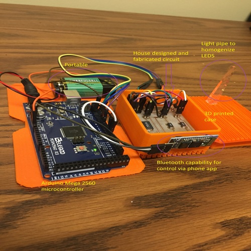

In this project, I partnered with an electrical engineering student to create a firefly spectra emulation device. 

Biologists at the University of Georgia desired a field-portable device which could emulate firefly communication patterns such that they could study variations in firefly genetics across populations. 

We designed and built a prototype of the device from scratch, including a 3D printed case and milling and baking our own printed circuit board. 

We were limited on time with only 10 weeks start-finish, and it did have some flaws. It was overall a successful design and implementation but needed more fine-tuning and manhours. 

The professor mentioned at the end that he may put it forward as a capstone project to finish the device. 

Here is our prototype: 
  

